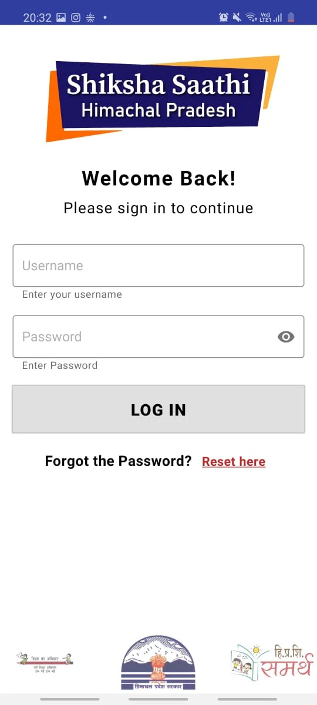
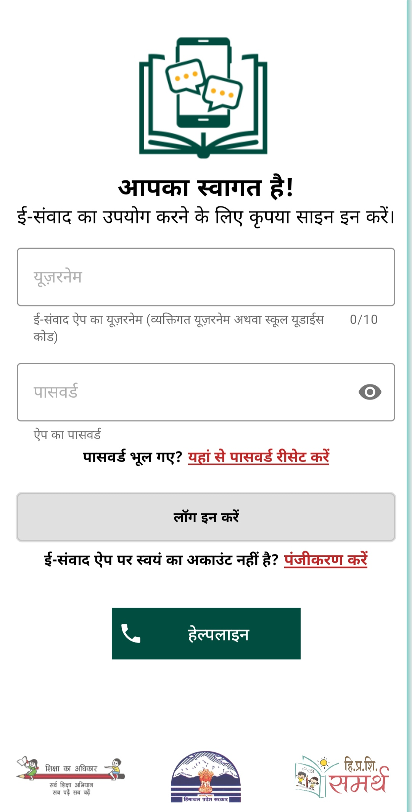
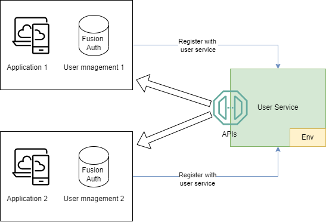

## Overview

Most applications maintain a user login module. This is essentially created to ensure that only authorized users are accessing the application. All the authentication and authorization modules require a few basic flows like, Login, Reset password, Updating user, etc.

Typically each app ends up creating its own backend flows. And then, in the long run, it is also required to maintain the backend code as well as manage the load as per the usage of the application.

User service is open-source software built to address the above-mentioned redundancy of backend effort. It offers a set of backend APIs, which can be leveraged by any application. 

- User service does not store or manage the Application’s user data. The user data remains within the host application’s user management auth service like Fusion Auth. 
- The host application registers itself with the User service by sharing the credentials. On registration, the application can start using the Auth service.

- At the same time, multiple applications can register with a single running instance of user service. 

For example, Uber has two apps, the rider app, and the driver app. For both the apps, it does not need to create a separate authentication backend. Uber can register both apps on user service and use the APIs for both apps.

### ⚒️ Use Cases

Example for the governance ecosystem - In the state of Himachal Pradesh there are two apps used by the Department of Education. 

- Shiksha Saathi  
- e-Samwad

e-Samvad is used by teachers for capturing student attendance, sharing content with students et al. While Shiksha Saathi is used by mentors and officers to capture their recordings of monthly school visits.

Both the apps are used by a different set of users and maintain their own user management over different Fusion Auth instances. They both can register to the same user service instance and leverage all the readily available APIs.

> Shiksha sathi and e-Samwad login portal

 
&nbsp; &nbsp; &nbsp; &nbsp;

### 🪜 User Service High Level Diagram

This diagram captures the high-level view of the User service and how different applications can register on the user service for using its APIs.

User service only provides Backend APIs, the frontend has to be maned by the host application.

### 💁‍♂️ Currently supported:

1. User management auth service - [Fusion Auth](https://github.com/fusionauth)
2. SMS service providers - [CDAC](/src/user/sms/cdac/) and [Gupshup](/src/user/sms/gupshup/)

